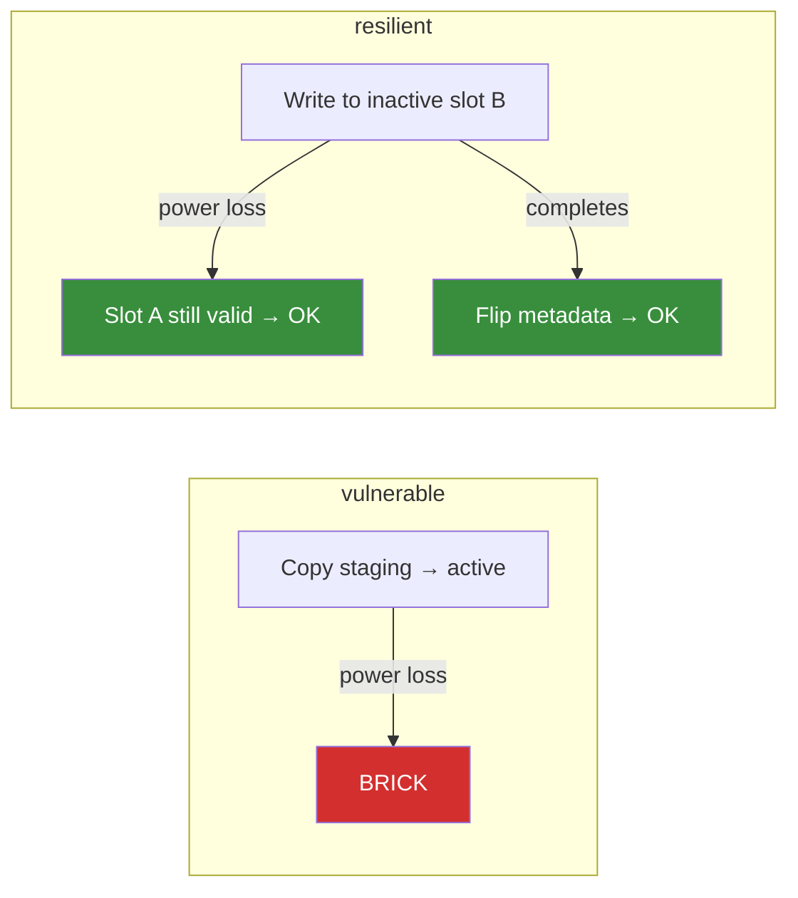

# ota-resilience

Power-loss fault injection testbed for OTA firmware updates under Renode.

## What this is

A framework for testing whether your firmware survives power loss at every
write point during an OTA update. You bring your firmware and OTA logic,
wire up a scenario script, and the campaign runner sweeps every write index
through Renode with a simulated fault.

## Included examples

Two built-in scenarios:

| Scenario     | Strategy                                   | Brick rate | Why                                              |
| ------------ | ------------------------------------------ | ---------- | ------------------------------------------------ |
| `vulnerable` | Copy-in-place, no checks                   | ~88%       | Overwrites only image; any mid-copy fault bricks |
| `resilient`  | A/B slots + bootloader + metadata replicas | 0%         | Active slot never touched during update          |



See [docs/architecture.md](docs/architecture.md) for detailed flow diagrams
and MRAM memory layout.

## What this project provides

- Custom Renode MRAM peripheral with persistent backing store across reset:
  `peripherals/MRAMController.cs`
- Fault-point scenario execution for vulnerable and resilient flows:
  `scripts/run_vulnerable_fault_point.resc`, `scripts/run_resilient_fault_point.resc`
- Canonical campaign runner using Robot + `renode-test` with thin Python orchestration:
  `tests/ota_fault_point.robot`, `scripts/ota_fault_campaign.py`
- Campaign reports and comparative table generation:
  `results/campaign_report.json`, `results/comparative_table.txt`

## Design principles

- Live Renode-first execution (no simulate-first campaign path).
- State-based outcomes (slot/metadata/memory markers), not log text heuristics.
- Keep custom logic only where it adds value:
  `MRAMController.cs` + OTA scenario logic.
- Reproducible CI with pinned Renode action, Renode revision, and toolchain.

## Quick start

Prerequisites:

- `python3`
- `renode-test` available on `PATH` (or set `RENODE_TEST=/full/path/to/renode-test`)

Run comparative campaign:

```bash
python3 scripts/ota_fault_campaign.py \
  --scenario comparative \
  --fault-range 0:13824 \
  --fault-step 5000 \
  --output results/campaign_report.json \
  --table-output results/comparative_table.txt
```

Refresh README comparative table block from live report:

```bash
python3 scripts/update_readme_from_report.py \
  --report results/campaign_report.json \
  --readme README.md
```

Prebuilt example `.elf` and `.bin` artifacts are committed, so clone-and-run
works without a cross-compiler.

## Optional firmware rebuild

If you modify example firmware sources:

```bash
cd examples/vulnerable_ota && make
cd ../resilient_ota && make
```

Requires `arm-none-eabi-gcc` on `PATH`.

## Validation and tests

Run campaign-level and peripheral tests:

```bash
renode-test tests/mram_peripheral.robot
renode-test tests/ota_resilience.robot
```

The `tests/ota_resilience.robot` suite parses report JSON and asserts structured
fields (not serialized string matching).

## CI and reproducibility

- Workflow: `.github/workflows/ci.yml`
- Pinned action: `antmicro/renode-test-action@0705567acf04d7b998d7deac1e05d9067d70d901`
- Pinned Renode revision: `d66b0c2aa3d420408eccecfd1d3bab0fd702a6db`
- Pinned toolchain: xPack `13.2.1-1.1` with SHA256 verification

## Testing your own firmware

The examples are starting points. To test your OTA implementation:

1. Write a `.resc` scenario script that models your update flow
   (see `scripts/run_vulnerable_fault_point.resc` for the pattern).
2. Define success/failure by reading MRAM state (slot markers, metadata,
   vector tables) — not log text.
3. Replace example ELFs/bins with your build outputs, or load them in your `.resc`.
4. Run the campaign over your write range:

```bash
python3 scripts/ota_fault_campaign.py \
  --scenario your_scenario \
  --fault-range 0:YOUR_TOTAL_WRITES \
  --fault-step 100 \
  --output results/your_report.json
```

The MRAM peripheral and fault injection model work with any Cortex-M firmware
that writes to MRAM. You just need to tell it what "success" and "failure"
look like for your design.

## Repository layout

```text
ota-resilience/
├── peripherals/MRAMController.cs
├── platforms/cortex_m0_mram.repl
├── scripts/
├── examples/
├── tests/
├── docs/
└── results/
```

## Limitations

- Fault model is at write-operation granularity, not analog brownout simulation.
- Example outcomes model representative OTA behaviors; adapt markers for your firmware.
- If the repository has no commits yet, report metadata shows
  `unavailable (no commits yet)` for commit hash.

## Documentation

- [Getting started](docs/getting_started.md) -- prerequisites, installation verification, running campaigns
- [Architecture](docs/architecture.md) -- MRAM layout, OTA flow diagrams, fault injection model
- [MRAM model](docs/mram_model.md) -- peripheral semantics, register map, read-only alias
- [Fault injection](docs/fault_injection.md) -- campaign runner, Robot integration, report rendering
- [Results schema](results/README.md) -- JSON report format and outcome taxonomy
- [Contributing](CONTRIBUTING.md) -- adding scenarios, modifying the MRAM model, reporting results

## License

Apache 2.0. See `LICENSE`.
