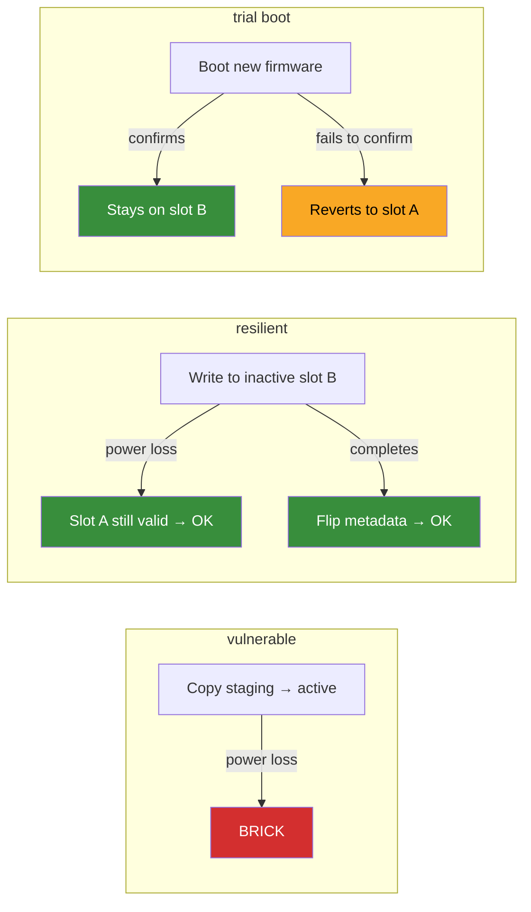

# ota-resilience

Power-loss fault injection testbed for OTA firmware updates under Renode.

## What this is

A framework for testing whether your firmware survives power loss at every
write point during an OTA update. You bring your firmware and OTA logic,
wire up a scenario script, and the campaign runner sweeps every write index
through Renode with a simulated fault.

## Included examples

Three built-in scenarios:

| Scenario     | Strategy                                   | Brick rate | Why                                              |
| ------------ | ------------------------------------------ | ---------- | ------------------------------------------------ |
| `vulnerable` | Copy-in-place, no checks                   | ~88%       | Overwrites only image; any mid-copy fault bricks |
| `resilient`  | A/B slots + bootloader + metadata replicas | 0%         | Active slot never touched during update          |
| `trial boot` | Rollback on unconfirmed firmware           | automatic  | Bad firmware reverts after max boot attempts     |



See [docs/architecture.md](docs/architecture.md) for detailed flow diagrams
and NVM memory layout.

## What this project provides

- Custom Renode NVM peripheral with persistent backing store across reset:
  `peripherals/NVMemoryController.cs`
- Fault-point scenario execution for vulnerable, resilient, and trial boot flows:
  `scripts/run_vulnerable_fault_point.resc`, `scripts/run_resilient_fault_point.resc`,
  `scripts/run_trial_boot_fault_point.resc`
- Built-in campaign runner using Robot + `renode-test` with thin Python orchestration:
  `tests/builtin_fault_point.robot`, `scripts/ota_fault_campaign.py`
- Generic campaign runner for custom firmware/platform integrations:
  `tests/generic_fault_point.robot`
- Campaign reports and comparative table generation:
  `results/campaign_report.json`, `results/comparative_table.txt`

## Design principles

- Live Renode-first execution (no simulate-first campaign path).
- Execution-backed fault outcomes by default (`--evaluation-mode execute`).
- Fast state-evaluator mode available for broad sweeps (`--evaluation-mode state`).
- Keep custom logic only where it adds value:
  `NVMemoryController.cs` + OTA scenario logic.
- Reproducible CI with pinned Renode action, Renode revision, and toolchain.

## Quick start

Prerequisites:

- `python3`
- `renode-test` available on `PATH` (or set `RENODE_TEST=/full/path/to/renode-test`)

Run comparative campaign:

```bash
python3 scripts/ota_fault_campaign.py \
  --scenario comparative \
  --evaluation-mode execute \
  --fault-range 0:28160 \
  --fault-step 5000 \
  --output results/campaign_report.json \
  --table-output results/comparative_table.txt
```

Campaign runs include one automatic unfaulted control point by default
(`fault_at` uses a high sentinel beyond campaign writes, tagged as
`is_control: true` in results). Disable with `--no-control`.

For CI gating, use assertion flags:

```bash
# Fails if any non-control fault point does not boot successfully.
# Also fails if the automatic control run does not boot.
python3 scripts/ota_fault_campaign.py \
  --scenario resilient \
  --fault-range 0:28160 \
  --fault-step 5000 \
  --assert-no-bricks \
  --assert-control-boots \
  --output results/campaign_report.json
```

Exit codes:

- `0`: run completed and assertions passed
- `1`: assertion failure
- `2`: infrastructure failure (Renode/test setup/input errors)

`--assert-no-bricks` applies to all scenarios in the current run. For
scenario-specific gating, run campaigns separately (for example, run
`--scenario resilient` instead of `comparative`).

For manual deep debugging, enable per-point instruction tracing:

```bash
python3 scripts/ota_fault_campaign.py \
  --scenario resilient \
  --fault-range 0:28160 \
  --fault-step 5000 \
  --trace-execution \
  --output results/campaign_report.json
```

Trace files are written under `results/<output_stem>_traces/` and referenced in
`results.<scenario>[].fault_diagnostics.execution_trace` for faulted points.

Built-in asset overrides are explicitly variant-scoped:

- `--platform-repl`
- `--vulnerable-firmware-elf`
- `--vulnerable-staging-image`
- `--resilient-bootloader-elf`
- `--resilient-slot-a-image`
- `--resilient-slot-b-image`
- `--resilient-boot-meta-image`

Refresh README comparative table block from live report:

```bash
python3 scripts/update_readme_from_report.py \
  --report results/campaign_report.json \
  --readme README.md
```

Prebuilt example `.elf` and `.bin` artifacts are committed, so clone-and-run
works without a cross-compiler.

## Optional firmware rebuild

If you modify example firmware sources:

```bash
cd examples/vulnerable_ota && make
cd ../resilient_ota && make
```

Requires `arm-none-eabi-gcc` on `PATH`.

### Bootloader VTOR Relocation

The resilient bootloader supports vector table relocation before jumping to an
application slot (`ENABLE_VTOR_RELOCATION` in `examples/resilient_ota/bootloader.c`).

`examples/resilient_ota/Makefile` now auto-selects this flag from `TARGET_CPU`:

- `TARGET_CPU=cortex-m0` -> `ENABLE_VTOR_RELOCATION=0`
- any other target (including `cortex-m0plus`) -> `ENABLE_VTOR_RELOCATION=1`

Override explicitly when needed:

```bash
# Physical M0+ target (default behavior)
make -C examples/resilient_ota TARGET_CPU=cortex-m0plus ENABLE_VTOR_RELOCATION=1

# Cortex-M0 target (no VTOR)
make -C examples/resilient_ota TARGET_CPU=cortex-m0 ENABLE_VTOR_RELOCATION=0
```

## Validation and tests

Run campaign-level and peripheral tests:

```bash
renode-test tests/nvm_peripheral.robot
renode-test tests/ota_resilience.robot
renode-test tests/trial_boot.robot
```

The `tests/ota_resilience.robot` suite parses report JSON and asserts structured
fields (not serialized string matching).

Trial-boot rollback in simulation is driven by explicit machine resets in
`scripts/run_trial_boot_fault_point.resc`. On physical boards, equivalent behavior
requires a hardware watchdog reset path.

## CI and reproducibility

- Workflow: `.github/workflows/ci.yml`
- Pinned action: `antmicro/renode-test-action@0705567acf04d7b998d7deac1e05d9067d70d901`
- Pinned Renode revision: `d66b0c2aa3d420408eccecfd1d3bab0fd702a6db`
- Pinned toolchain: xPack `13.2.1-1.1` with SHA256 verification
- Latest-Renode canary workflow: `.github/workflows/renode-latest-canary.yml`
  (daily schedule + manual trigger; fails on regressions against `renode-latest`)

## Testing your own firmware

Use `tests/generic_fault_point.robot` for generic external firmware campaigns.

```bash
# Copy-in-place OTA (no bootloader)
python3 scripts/ota_fault_campaign.py \
  --scenario my_copy_ota \
  --robot-suite tests/generic_fault_point.robot \
  --robot-var FIRMWARE_ELF:/path/to/my/firmware.elf \
  --robot-var PLATFORM_REPL:/path/to/my/platform.repl \
  --robot-var PERIPHERAL_INCLUDES:/path/to/stub1.cs;/path/to/stub2.cs \
  --robot-var FAULT_POINT_SCRIPT:scripts/run_copy_in_place_fault_point.resc \
  --fault-range 0:28672 \
  --fault-step 1000 \
  --total-writes 28672 \
  --output results/my_report.json

# A/B bootloader OTA
# Generate a metadata blob in whatever format your bootloader expects.
python3 scripts/gen_boot_meta.py --output /tmp/my_boot_meta.bin

python3 scripts/ota_fault_campaign.py \
  --scenario my_ab_ota \
  --robot-suite tests/generic_fault_point.robot \
  --robot-var BOOTLOADER_ELF:/path/to/my/bootloader.elf \
  --robot-var BOOT_META_BIN:/tmp/my_boot_meta.bin \
  --robot-var PLATFORM_REPL:/path/to/my/platform.repl \
  --robot-var PERIPHERAL_INCLUDES:/path/to/stub1.cs;/path/to/stub2.cs \
  --robot-var FAULT_POINT_SCRIPT:scripts/run_bootloader_ab_fault_point.resc \
  --boot-mode direct \
  --slot-a-image-file /path/to/my/current_slot_a_image.bin \
  --slot-b-image-file /path/to/my/staged_image.bin \
  --ota-header-size 128 \
  --fault-range 0:28160 \
  --fault-step 1000 \
  --total-writes 28160 \
  --output results/my_ab_report.json
```

`--boot-mode` selects A/B interpretation:

- `direct`: slot B validity is considered a direct boot target.
- `swap`: slot B is treated as staging; outcome is based on runtime boot evidence, not slot-B vector validity.

`--slot-a-image-file` seeds slot A from a pre-built image (useful when slot A
must contain the same headerized format as slot B).

`--slot-b-image-file` makes the A/B script write a pre-built staging image into
slot B (header included). Leave it unset to keep copy-from-slot-A behavior.
`--ota-header-size` shifts vector-table validation for headerized formats.

The A/B fault script emits per-point `fault_diagnostics` (fault region,
corrupted bytes, expected bytes when known) to make fallback/brick outcomes
actionable.

`--scenario` accepts any string. Built-in names (`vulnerable`, `resilient`,
`comparative`) keep their existing behavior; any other name runs a single custom campaign.

Flash-like targets:

- Use `platforms/cortex_m4_flash.repl` as a reference profile (`WriteGranularity=256`, `SectorSize=4096`, erase-before-write enforced).
- Override script granularity when your update path writes pages instead of 8-byte words:
  - `--robot-var WRITE_GRANULARITY:256`
- Scale `--total-writes` to your write granularity (`slot_bytes / write_granularity`).

The NVM peripheral and fault injection model work with any Cortex-M firmware
that writes to NVM. You just need to tell it what "success" and "failure"
look like for your design.

## OSS bootloader validation

Use `scripts/run_oss_validation.py` with a profile manifest to run named
external validations.

Positive guard (current upstream MCUboot must stay resilient):

```bash
python3 scripts/run_oss_validation.py \
  --manifest docs/oss_validation_profiles.json \
  --profile mcuboot_swap_current_guard \
  --renode-test /path/to/renode-test
```

Negative control (known-bad commit must fail no-bricks guard):

```bash
python3 scripts/run_oss_validation.py \
  --manifest docs/oss_validation_profiles.json \
  --profile mcuboot_swap_known_bad_guard \
  --renode-test /path/to/renode-test
```

This command is expected to return non-zero, proving the detector catches the
known-bad regression.

These guards use:

- `scripts/bootstrap_mcuboot_matrix_assets.sh` to materialize Zephyr workspace
  and signed/padded slot images under `results/oss_validation/assets/`.
- `-DCMAKE_GDB=.../arm-none-eabi-gdb` to avoid `gdb-py` probe hangs on macOS.
- `platforms/nrf52840_nvmc_psel.repl` as the generic nRF52840 overlay.

Manual CI workflow for this path:

```bash
gh workflow run oss-validation.yml
```

Containerized run (same dependency set used by CI workflow):

```bash
docker build -f docker/oss-validation.Dockerfile -t ota-oss-validation .
docker run --rm -it -v "$PWD:/workspace" ota-oss-validation bash -lc '
  ./scripts/bootstrap_mcuboot_matrix_assets.sh &&
  python3 scripts/run_oss_validation.py \
    --manifest docs/oss_validation_profiles.json \
    --profile mcuboot_swap_current_guard \
    --renode-test renode-test \
    --output results/oss_validation/mcuboot_swap_current_guard.json
'
```

## Comparative snapshot

<!-- COMPARATIVE_TABLE:START -->

```text
Run a comparative campaign and then execute:
python3 scripts/update_readme_from_report.py --report results/campaign_report.json --readme README.md
```

<!-- COMPARATIVE_TABLE:END -->

## Documentation

- [Getting started](docs/getting_started.md) -- prerequisites, installation verification, running campaigns
- [Architecture](docs/architecture.md) -- NVM layout, OTA flow diagrams, fault injection model
- [NVM model](docs/nvm_model.md) -- peripheral semantics, register map, read-only alias
- [Fault injection](docs/fault_injection.md) -- campaign runner, Robot integration, report rendering
- [Results schema](results/README.md) -- JSON report format and outcome taxonomy
- [Contributing](CONTRIBUTING.md) -- adding scenarios, modifying the NVM model, reporting results

## License

Apache 2.0. See `LICENSE`.
