# Architecture

## MRAM memory layout

The platform maps a single 512 KB MRAM backing store at three bus addresses:

```mermaid
block-beta
    columns 1
    block:mram["MRAM (0x10000000 -- 0x1007FFFF, 512 KB)"]
        columns 5
        A["Slot A\n0x10002000\n216 KB"] B["Staging/Slot B\n0x10038000\n224 KB"] META["Metadata\n0x10070000\n2 × 256 B"] PERSIST["Persistence\n0x10070200+"] PAD["Reserved"]
    end
```

| Region           | Address range              | Size         | Purpose                                                  |
| ---------------- | -------------------------- | ------------ | -------------------------------------------------------- |
| Boot alias       | `0x00000000`               | mirrors MRAM | CPU fetches vectors/code from here at reset              |
| Slot A (active)  | `0x10002000 -- 0x10037FFF` | 216 KB       | Active firmware image                                    |
| Staging / Slot B | `0x10038000 -- 0x1006FFFF` | 224 KB       | Download/staging area (vulnerable) or slot B (resilient) |
| Boot metadata    | `0x10070000 -- 0x100701FF` | 512 B        | Two 256-byte CRC-protected replicas                      |
| Persistence      | `0x10070200+`              | remainder    | Boot counters, copy markers                              |
| NV read alias    | `0x10080000`               | mirrors MRAM | Read-only mirror; writes silently dropped                |
| Controller regs  | `0x40001000`               | 0x28         | STATUS, CONFIG, CONTROL, ECC counters                    |

The boot alias at `0x00000000` means the Cortex-M0+ vector table fetch
reads directly from MRAM. Corrupting the first 8 bytes of the active slot
is equivalent to bricking the device.

## Vulnerable copy-based OTA flow

The vulnerable firmware (`examples/vulnerable_ota/firmware.c`) copies a
staged image word-by-word from `0x10038000` into the active slot at
`0x10000000`. A power loss at any point during the copy leaves a partially
written vector table and the device will not boot.

The critical vulnerability: there is exactly one copy of the firmware, and
the copy overwrites it in-place. Any interruption leaves no valid image.

## Resilient A/B bootloader flow

The resilient design (`examples/resilient_ota/bootloader.c`) never
overwrites the running image. New firmware is written to the inactive slot,
then metadata is atomically updated to point at the new slot.

### OTA update sequence (host-driven)

The key invariant: at every possible fault point, at least one valid
(slot + metadata) pair exists. The bootloader tries the requested slot
first, falls back to the other if vectors are invalid.

## Fault injection model

The campaign runner (`scripts/ota_fault_campaign.py`) iterates over
write indices and injects a partial-write fault at each one via the
MRAM controller's `InjectPartialWrite` method. This zeros the upper
half of the 8-byte word being written, simulating a power loss
mid-program cycle.

Outcomes are determined by reading MRAM state (vector table validity,
metadata CRC, slot markers) -- not by log text parsing.
